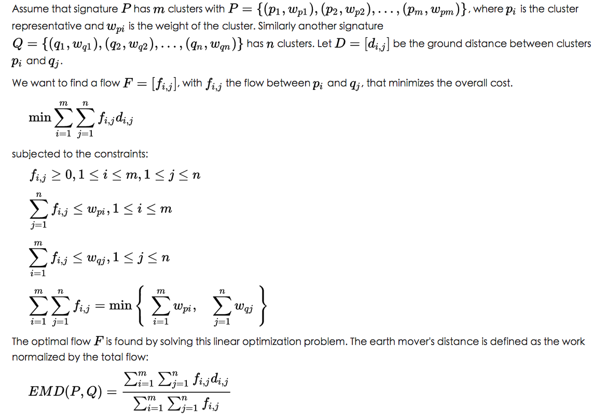

# topic-classifier

## 分类器核心算法

### 本分类器的数据类型
分类器中要用到两类数据，一类是training data，用来确立分类的标准，一类是test data，用来实现分类的目的。

此分类器用到的数据，都是文本数据，在2013年以后，在使用文本数据时，一般都是用word embedding（word2vec或者GloVe）。之前，每个word都构成坐标的一个维度，坐标的具体值是文本中出现这个词的频数。因此，对于一个文本来说，就是a sparse vector with elements related to the number of times a given word appears in the document (this includes approaches such as tf-idf as well).

在使用文本数据时，一般有两种做法，一种是把文本当做词汇的组合，即bag-of-words (BoW) approach（不一定是tf-idf方法，也可能使用了word embedding），也是传统的做法，另一种是把文本当做词汇的有序排列，在近年来的神经网络模型数据中有使用，比如，当使用CNN扫描来进行文本分类时。毫无疑问，后一种数据所包含的信息更多，但是，数据的维度也更多，计算量更大。在实际应用中，对于很大的文本，前者比较实用；对于简短的句子的分类，可以考虑后者。
另外，当文本非常巨大时，所使用的词汇不一定是文中出现的所有词汇，也可以是文中出现频率最高的10个、100个、1000个词汇，或者是用其他算法得到的关键词。
比如，在使用WMD模型进行文本数据分析时，因为非常高的时间复杂度，就只能选择文本中出现频率较高的词汇。

### 本分类器的基本思想
本分类器使用的是KNN（K Nearest Neighbor）的思想，根据距离的相对大小（或者similarity的相对大小）来进行分类。但是，用来计算距离的坐标（word embedding），是通过神经网络模型拟合得到的。

一种距离测度：[EMD (Earth Mover's Distance)](https://en.wikipedia.org/wiki/Earth_mover's_distance)

EMD是两个离散的概率分布之间的距离，每个概率分布的具体取值是用多个向量来表示的。每个概率分布叫做一个signature，包含两部分，一部分是多个向量，另一部分是各个向量的权重（对于一个signature，总权重等于1）。Assume that signature P has m clusters with P={(p1,wp1),(p2,wp2),...,(pm,wpm)}。不同的p就是多个向量，不同的w就是各个向量的权重。

在上面的介绍中，D是euclidean distance，是可以由p求出来的。要得到optimal flow F，需要求解一个线性优化问题。然后根据optimal flow F，就能求出EMD了。求EMD时，需要用到两个概率分布各自的向量权重，也需要两两向量之间的欧式距离D，但是不需要具体的向量坐标了。

求EMD有一个明确的算法，在python中（python3）有一个很好的包[pyemd](https://pypi.python.org/pypi/pyemd)。
* [pyemd的github](https://github.com/wmayner/pyemd)
* [Fast Earth Mover's Distance (EMD) Code](http://www.ariel.ac.il/sites/ofirpele/fastemd/code/)
求解EMD还有一个python2的包[python-emd](https://github.com/pdinges/python-emd)，但现在很少用了。

EMD的具体使用场景：[Word Mover's Distance (WMD)](http://proceedings.mlr.press/v37/kusnerb15.pdf)

EMD用于大数据分析的话，必须关注其时间复杂度，EMD的时间复杂度很差，为O(p^3 log(p))，用于文本分析的话，p是文本中所有word的数目。因此，要实现快速分析，p不宜太大。

WMD模型发表公布于International Conference on Machine Learning in 2015。EMD中的p对应word embeding（比如word2vec），EMD中的w对应各个word在相应的文本中出现的频数（normalization之后的频数），EMD中的D对应不同word embeding的euclidean distance。EMD中的两个概率分布，在WMD中表现为两个文档中的word embedding。在各自的文本中，各个word出现的频数之和用来做normalization的分母，使得一个文本中各个词的w之和为1。

[word2vec](https://papers.nips.cc/paper/5021-distributed-representations-of-words-and-phrases-and-their-compositionality.pdf)由google团队发表于2013年，在[spacy](https://spacy.io/)这个python包中，有已经训练好的word2vec的word embedding，是根据the Common Crawl corpus数据通过神经网络模型来训练的。

